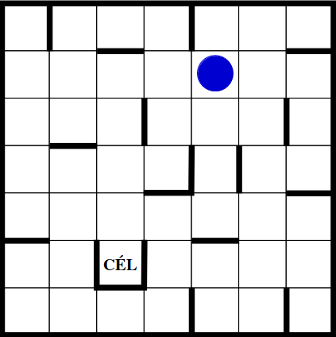

# ball-game

## Goal of the game
In this simple logical **ball game** your goal is to move the ball to the **finish** field.

## Details of the game
The game is played on a board, which consists of 7 rows and 7 columns, thus there are 49 fields available.
Each field has 4 sides. There are some fields, which have some walls around them.

## Business logic of the game
The ball can move to four directions: up, down, right, left.
If we force the ball to move somewhere, it goes continously to the chosen way until it hits the edge of the board or a wall.
The ball can't go out of the board, nor can't go through the walls.

## Sample of the game

